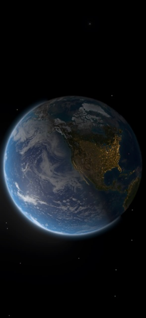
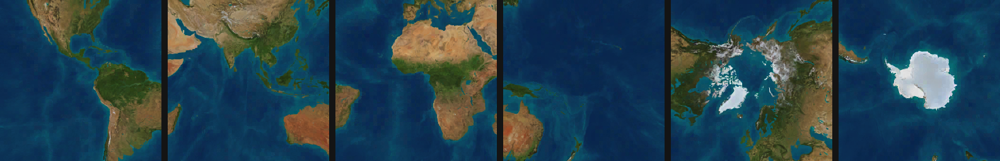
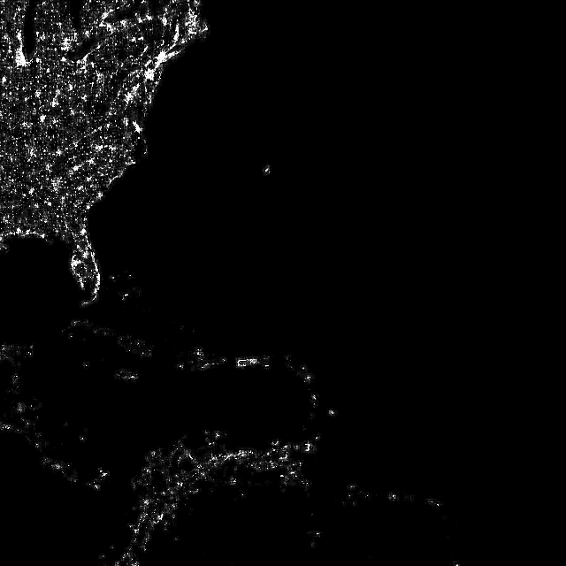
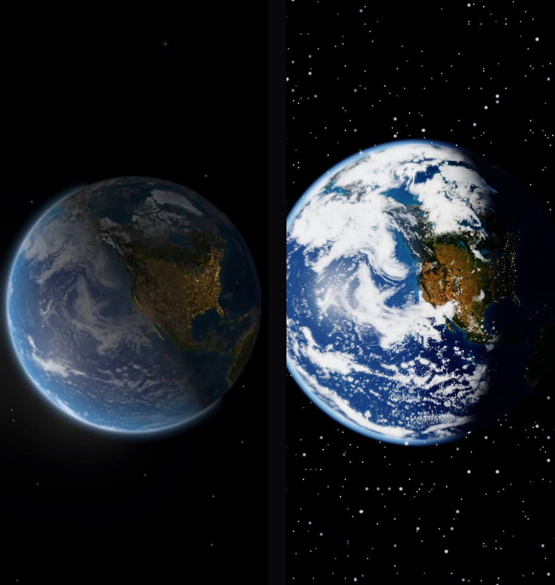

# How the iOS 27 Earth lock screen actually works

<p align="center">
  
</p>

<p align="center"><em>Apple's own shipped preview of the wallpaper, pulled out of the firmware.</em></p>

Everyone has seen this wallpaper. It looks like a photograph of Earth. It is not — it
is a **ray-traced planet, lit in real time, wrapped in three shells of real weather
downloaded from Apple's servers**, with your own position pulsing on the surface.

This is a teardown of how it is built, from the firmware image, plus a working
reconstruction of it in Metal.

**Source:** `iPhone17,1_27.0_24A5408d_Restore.ipsw` — iOS 27.0 beta 5 for iPhone 16 Pro,
from Apple's public CDN, 16 August 2026.

---

## What it is called

Nothing in the firmware is labelled "Earth wallpaper". The trail runs through
codenames — Apple names poster extensions after gods and flowers.

| | |
|---|---|
| Shown to you as | **Astronomy → Earth** |
| Internal codename | **Aegir** (Norse sea god) |
| Bundle | `com.apple.NanoUniverse.AegirProxyApp` |
| Extension | `AegirPoster.appex` |
| Variants | `V01-Earth`, `V02-Moon`, `V03-Mars` |
| Role | `PRPosterRoleLockScreen` — lock screen only |
| Renderer | `NUNIAegirRenderer` in `NanoUniverse.framework` |

Two strings settled it. The display name is **Astronomy**, and it asks for location
with a sentence that describes the wallpaper exactly:

> *"Your location is used to display your position on the globe."*

The same engine drives the Apple Watch Astronomy face, which is why it lives in a
framework called `NanoUniverse` — "Nano" being Apple's long-standing prefix for watch
software. One renderer, two products.

---

## Finding 1 — there is no sphere. It is ray-traced.

No mesh, no geometry. The renderer's own method is `_renderRaytraceSpheroid:`, and
the vertex format gives it away: `NUNIAegirVrt_P2Vertex` is a pair of 16-bit
integers, enough for the corners of a flat quad and nothing more.

Apple draws a rectangle over the screen and, for every pixel, fires a ray and solves
mathematically where it strikes the planet. Every radius in the uniform block is a
**squared** radius — the arithmetic of ray–sphere intersection.

And it is not one sphere but six concentric shells, tested in turn:

| Shell | Uniform | What it is |
|---|---|---|
| 1 | `floorRadiusSqr` | the solid surface — colour, relief, city lights |
| 2 | `cloudLoRadiusSqr` | low weather deck |
| 3 | `cloudMdRadiusSqr` | mid deck, offset by `cloudAltitude` |
| 4 | `cloudHiRadiusSqr` | high deck, thinnest |
| 5 | `atmosRadiusInner` | where the blue haze begins |
| 6 | `atmosRadiusOuter` | the glowing rim against black space |

Because the clouds sit at genuine altitude *above* the surface rather than being
painted onto it, they cast real shadows and slide with parallax as the globe turns.
There are dedicated controls for exactly that: `earthCloudShadowStrength`, ramped
between `earthCloudShadowEaseFrom` and `earthCloudShadowEaseTo`.

## Finding 2 — the clouds are real weather, and they expire

The strongest find. `AegirCloudCoverService` does not use canned imagery. It
**downloads current cloud cover from Apple** and re-skins the planet with it.

It fetches three files — `cloudLevelLow`, `cloudLevelMid`, `cloudLevelHigh` — one per
altitude deck, matching the three shells the shader intersects. A converter combines
and transcodes them for the GPU. The lifecycle is spelled out in strings left in the
binary:

```
Clouds textures expired.
CloudCoverExpiredNotification
Cached cloudTextureURLs: %s
Combining cloud textures for level: %s %s
Failed to download cloud data: %s. Error: %s, Response: %@
```

So the weather on your lock screen has a shelf life. When it lapses the wallpaper
posts an expiry notification and fetches a fresh set. Within the limits of that
refresh, the globe is showing you the actual sky.

## Finding 3 — Earth is a cube map

Earth ships as **24 texture tiles**, and the grouping gives it away: six groups of
four. It is a cube map — the surface projected onto the six faces of a cube, each
face a 2×2 grid of 1024px tiles, so 2048×2048 per face. Cube maps avoid the pinching
and wasted resolution you get at the poles with a flat rectangular world map.



*The six faces, decoded from ASTC and reassembled: the Americas · Asia and the Indian
Ocean · Africa and Europe · the Pacific and Australia · the Arctic · Antarctica.*

Four layers, and the detail budget is spent where the eye looks:

| Layer | Tile | Compression | Mips | Carries |
|---|---|---|---|---|
| albedo | 1024² | ASTC 6×6 | 11 | surface colour, including seafloor bathymetry |
| normal | 1024² | ASTC 6×6 | 11 | terrain relief, so mountains catch light |
| emissive | 640² | ASTC 4×4 | 10 | city lights in RGB, water mask in alpha |
| cloud | 384² | ASTC 4×4 | 9 | cloud opacity — replaced at runtime by live data |

Earth is the only body that gets all four. Mercury, the Moon and Mars ship colour and
relief. The gas giants ship colour alone — no solid surface to catch a shadow. Saturn
gets one extra 384×1 strip: its rings.

## Finding 4 — the emissive layer is packed two ways



RGB holds the city lights **in colour**, so sodium-orange streetlights and white LED
districts read differently.

Alpha holds something else entirely: a land-and-water mask with river networks drawn
into it. That mask is what lets the shader grade continents and oceans independently
on each side of the terminator — `continentDayColor`, `continentNightColor`,
`oceanDayColor`, `oceanNightColor`.

The lone dot out in the Atlantic is Bermuda.

<br clear="right"/>

## The render pipeline

Seventeen shader entry points in the `aegir_*` family, recovered from the compiled
Metal library:

```
aegir_star_vsh / aegir_star_fsh / aegir_starfield_fsh   starfield
aegir_earth_fsh                                         the planet surface
aegir_luna_fsh / aegir_gaseous_fsh / aegir_saturn_fsh   other bodies
aegir_locdot_vsh / aegir_locdot_fsh                     your location beacon
aegir_sprite_sun_vsh / aegir_sprite_sun_fsh             the sun
aegir_threshold_fsh -> aegir_post_fsh -> aegir_display_fsh   bloom and composite
```

Sibling families ship alongside: `calliope_*` (the fuller solar-system renderer, with
tessellation, atmospheric scattering, Saturn's rings and an orrery view),
`classic_*` (the original watch renderer) and `globetrotter_*`.

The frame is assembled across three offscreen buffers — scene, bloom, post.

## The tuning surface

`NUNIAegirPipelineConstants` is 35 floats and reads like a lighting rig:

- **Sun** — distance, equatorial radius, glow radius, exposure floor, RGB colour
- **Surface** — `earthLightPower`, ambient, and specular power / strength /
  **breakup**, which stops the ocean acting as a perfect mirror
- **Night** — RGB and strength for city lights, so the dark half warms independently
- **Atmosphere** — RGB, strength, glow falloff, and a soft terminator ramp so day
  does not snap into night
- **Bloom** — radius, strength, threshold

Full class dump: [`findings/nanouniverse_classdump.txt`](findings/nanouniverse_classdump.txt).

## You are on it

That location permission is spent on one element: `NUNIAstronomyLocationDot`, a view
with an inner and outer disc that **pulses** (`pulseDuration`, `pulseAlphaDelay`),
with its own render pass and shader pair. The same beacon idiom as the blue dot in
Maps, transplanted onto a planet.

There is also `NUNIAstronomyRotationModel`, whose vocabulary is revealing: `push:`,
`isPulling`, `isAtHomeCoordinate`. The globe can be spun, and it knows how to come
back to where you are standing.

One last detail from the poster's rendering configuration: motion effects are off,
but the depth effect is left on. No gyroscope parallax — the globe is already
three-dimensional — but the clock still tucks behind Earth's limb.

---

## How this was read

Apple publishes beta firmware on an open CDN and the whole chain turned out to be
walkable without a device or a developer account.

1. **Locate the build** — a 12.3 GB restore image on `updates.cdn-apple.com`.
2. **Read it without downloading it** — an IPSW is a ZIP and the CDN honours byte
   ranges. Reading the archive index off the tail exposed all 133 members for about
   24 MB of traffic.
3. **Unlock the filesystem** — the root filesystem is an Apple Encrypted Archive
   whose header names a key URL on `wkms-public.apple.com`. Apple serves the
   unwrapping key openly.
4. **Mount it** — a 9.5 GB APFS volume that macOS mounts natively, read-only.
5. **Recover the code** — framework binaries live in the dyld shared cache inside a
   second encrypted volume. Extracting `NanoUniverse` from it gave the class list,
   method names and uniform structs quoted above.

The full method, including every dead end, is in
**[LEARNINGS.md](LEARNINGS.md)** — container formats, the ASTC size-matching trick
for identifying textures, and how the cube-map orientation was verified.

**What this does not cover.** The Aegir poster is delivered on demand, so the
extension binary itself is a placeholder in the firmware. Everything above comes from
the shared renderer that ships in the OS, plus the shipped textures and shaders.
Shader logic was read from compiled metadata — uniform names, texture bindings,
entry points — not decompiled arithmetic. The numeric values of the 35 constants live
in the downloadable payload, so the structure is known and the settings are not.

---

## The reconstruction

`app/` is a SwiftUI + Metal app that rebuilds the wallpaper using the same technique:
a full-screen quad, ray-traced against the same six concentric shells, sampling
Apple's own cube maps.



*Left: Apple's preview. Right: this reconstruction, same geography, different time of
day. The clouds and starfield are heavier than Apple's and the atmosphere is stronger
— tuning, not technique.*

Working: ray-traced globe and shells · real cube-map textures · day/night terminator
computed from actual solar position, locked to geography as the globe turns · city
lights · cloud shadows · atmosphere limb · ocean sun-glint with breakup · bloom chain
· pulsing location beacon · fullscreen.

**Not working: finger drag to spin.** `touchesBegan` is never called on the Metal
view — a touch-delivery problem, not a rendering one. An earlier build spun correctly
([proof](findings/images/demo-spin-before-after.png)); the regression came in with
the fullscreen changes. Evidence, ruled-out causes and the recommended fix are at the
end of [LEARNINGS.md](LEARNINGS.md).

### Building it

```bash
brew install xcodegen
cd app && xcodegen generate && open AegirDemo.xcodeproj
```

Needs Xcode 26+ with the Metal Toolchain (`xcodebuild -downloadComponent MetalToolchain`).

The Earth textures are **not** in this repository — they are Apple's, extracted from
firmware, and are not mine to redistribute. Regenerate them into `app/Resources/`
from an IPSW you have downloaded yourself:

```bash
python tools/make_assets.py     # needs pillow, numpy, texture2ddecoder
```

## Layout

```
app/          the Metal reconstruction
tools/        every script, in pipeline order — see tools/README.md
findings/     class dump, plists, full iOS 27 path listing, decoded imagery
LEARNINGS.md  method, container formats, and the open bug
```

Figures in `findings/` are Apple assets reproduced at reduced scale to illustrate the
analysis.
